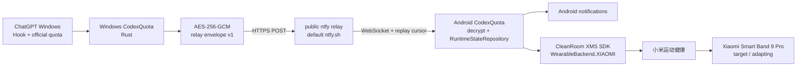

# CodexQuota Foundation 01 架构

本文记录 fork 当前正式 runtime。产品语义以根目录 `CONTEXT.md` 为准，迁移/验收状态以
`docs/current-status.md` 为准。

## 系统目标

目标设备是 **Xiaomi Smart Band 9 Pro（适配中）**。小米运动健康继续承担手环主连接、健康数据
和普通通知；CodexQuota 只增加额度、只读任务状态与提醒。Android 和手环不批准/拒绝操作，也不
反向控制 ChatGPT。



Windows 和 Android 不要求处于同一局域网。正式 runtime 不启动 UDP discovery、LAN WSS
`/pair`/`/sync` listener，也不创建防火墙入站规则。`windows-native/src/host.rs`、`network.rs`、
`pairing_discovery.rs` 与 Android 旧 WSS 类暂时保留为 legacy 对照。

## Windows

入口仍是 `windows-native/src/bin/codex_quota_windows.rs`：

- `QuotaCollector` 独立按低频节拍确认官方额度；relay 故障不停止本地采集和缓存。
- `HookTaskRuntime` 只归并官方 Hook 的裁剪状态和最多 16 字短标题。
- 正式入口创建 `RelayHost`，不创建 `WindowsHost` / `TcpListener`。
- `RelayCredentialStore` 生成并用当前用户 DPAPI 保存随机 topic、AES key 和 device ID。
- `RelaySequenceStore` 在每次发送前持久化新的单调 sequence，进程重启不回到 0。
- `RelayPublisher` 使用现有 reqwest 向 `<baseUrl>/<topic>` POST 纯文本 envelope，对网络失败、
  HTTP 429 和 5xx 做有限指数退避。发布任务串行化，失败与本地采集隔离。
- 成功确认官方 quota 后发布完整 snapshot；需要下游知道的任务状态变化立即发布完整 snapshot。

托盘“连接手机”生成二维码。每次明确重新配对/刷新二维码都会轮换 topic、key 与 device ID，使旧手机
凭据失效。ntfy 不提供可靠 subscriber presence，因此 Windows 只能显示 relay 已配置，不能把它伪装成
手机实时在线证明。

## Relay pairing v1

二维码 deep link 为 `codexquota://pair?relay=<base64url-json>`。解码后的严格字段：

```json
{
  "protocolVersion": 1,
  "type": "relay_pairing",
  "relayBaseUrl": "https://ntfy.sh",
  "topic": "<256-bit random base64url>",
  "key": "<256-bit AES key base64url>",
  "deviceId": "<128-bit random base64url>"
}
```

base URL 必须是无 userinfo/query/fragment 的 HTTPS origin。topic 不来源于用户名、机器名或项目名。
Android 扫码后扩展现有 `PairingCredentialStore`，使用独立 Android Keystore AES-GCM key 保存 relay
凭据，同时清除旧 cursor 与 sequence。旧 6 位 LAN discovery 代码暂停使用，不扩展为公网配对。

## Relay protocol v1

明文 domain payload 先在 Windows 本地序列化：

```json
{
  "protocolVersion": 1,
  "sequence": 42,
  "generatedAtMs": 1789516800000,
  "quota": { "protocolVersion": 3 },
  "tasks": [],
  "chatGptState": "running",
  "chatGptFocused": false
}
```

`quota` 复用 quota v3，`tasks` 复用 task v1 的 item/domain 结构，不复制平行模型。然后使用：

- AES-256-GCM；
- 每条消息由系统 CSPRNG 生成新的 96-bit nonce；
- 128-bit authentication tag（附在 ciphertext 中）；
- AAD = 固定 `CQ-RELAY-V1\0` magic + 32-byte topic identifier。

ntfy message body 只包含：

```json
{"version":1,"nonce":"<base64url>","ciphertext":"<base64url ciphertext+tag>"}
```

业务 payload 不进入 ntfy title、tags、priority、filename 或其他明文字段。协议 schema 位于：

- `contract/relay-pairing-v1.schema.json`
- `contract/relay-envelope-v1.schema.json`
- `contract/relay-payload-v1.schema.json`

## Android relay subscriber

`RelayWebSocketClient` 使用 OkHttp 订阅 `wss://<relay>/<topic>/ws`：

1. 没有可靠 cursor 时使用 `since=latest`，只恢复最新缓存 state；
2. 正常重连使用最后接受的 ntfy message ID 作为 `since` cursor；
3. `open`、`keepalive` 和其他非 `message` event 不进入 domain；
4. `message` 先严格解析 envelope，再用 topic-bound AAD 做 AES-GCM 认证解密；
5. 解密后严格解析 relay payload，持久化拒绝 `sequence <= lastAcceptedSequence`；
6. 接受后把 quota/task 送入现有 `RuntimeStateRepository` 和 `TaskAlertCoordinator`。

认证失败、未知字段、错误 topic、重复或倒退 sequence 都静默丢弃；实现不记录 key、ciphertext 或
plaintext。网络切换/断线进入有限退避重连。Android“刷新”只重连、恢复缓存并重新计算 freshness，
不发送 Android → Windows command。

## Xiaomi XMS 集成

`third_party/xms_wearable_sdk_cleanroom/` vendored upstream commit
`6483f939785e9c1dd011465d573931f669a6adab`，保留 MIT `LICENSE` 和 `UPSTREAM.md`。

Android Gradle 直接把其 `xms-wearable-lib` 作为源码 module 构建，不访问未经确认长期可用的 Maven
仓库，也不需要 `app/libs/xms-wearable-lib_1.4_release.aar`。现有
`com.xiaomi.xms.wearable.*` 调用保持不变；`XiaomiWearableBackend.initializer` 必须先执行
`WearableBackendConfig.setBackend(..., WearableBackend.XIAOMI)`，随后才创建 Node/Auth/Message/
Notify API。

应用 package identity 为 `io.github.rogerlang.codexquota`；Kotlin namespace 暂保留
`com.codex.quota.android`。Vela manifest 使用同一 identity。签名、真实权限和 Band 9 Pro 通信尚需
真机验证。

## 状态与隐私语义

- `PreToolUse` / `UserPromptSubmit` → 处理中（静默）。
- `PermissionRequest` → 需要授权（按设置提醒）。
- `Stop` → 等待查看（按设置提醒，不表示完成）。
- 断线继续保留最近可信 quota/task，并依据原有 freshness 显示缓存/过期，不猜测新值。
- 不进入 relay：prompt、response、tool args、terminal output、文件路径、Cookie、令牌、账号资料或完整日志。

## Legacy 边界

LAN WSS、UDP discovery、TLS pinning、旧 pairing schema 和相关测试暂留以便回滚与对照，但正式
入口和 Android Application 不实例化它们。后续删除 legacy 代码需单独任务，不在 Foundation 01 扩展范围。
