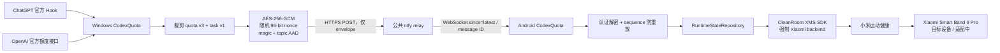

# Foundation 01 审阅报告

日期：2026-09-16
基线：`main` / `ef4b958e0b6904035ba92b8a0874bb2e06734b7a`
远端：`origin https://github.com/RogerLang/codex-quota-band.git`

## 结论

本地 Foundation 迁移已形成可审阅的未提交 diff：Android 已从 proprietary XMS AAR 切到固定
commit 的 CleanRoom 源码模块；Windows → Android 正式链路已切到 ntfy 端到端加密 relay；正式配对
改为二维码 relay credential；Android application ID 与 Vela package identity 已迁移到
`io.github.rogerlang.codexquota`。

自动测试、Android debug APK 构建和保留的 legacy RPK 构建均通过。没有执行 commit、push、PR 或
Release，也没有开始 Band 9 Pro Lua watchface、AOD、336×480 UI 或 Vela → Lua IPC。

## 架构



正式 Windows runtime 不启动旧 `WindowsHost`、LAN WSS `/pair`/`/sync` listener 或 UDP discovery，
也不需要防火墙入站规则。旧源码和测试暂留作 legacy 回滚/对照。

## 修改摘要与文件

### CleanRoom XMS

- `third_party/xms_wearable_sdk_cleanroom/`：vendored 完整源码、MIT `LICENSE` 与 `UPSTREAM.md`。
- `android-app/settings.gradle.kts`、`android-app/build.gradle.kts`、
  `android-app/app/build.gradle.kts`：把 CleanRoom 作为本地 Android library module 构建；删除私有 AAR
  依赖。
- `android-app/app/src/main/java/com/codex/quota/android/runtime/XiaomiWearableBridge.kt`：在任何
  `Wearable.get*Api()` 前调用 `WearableBackendConfig.setBackend(..., WearableBackend.XIAOMI)`；原桥接
  业务结构未重写。
- `WearableBackendInitializerTest.kt`：验证 backend 配置顺序，并以编译方式覆盖 `NodeApi`、`AuthApi`、
  `MessageApi`、`NotifyApi`、`DataItem`、两个 listener 与 `Permission`。

Upstream：`https://github.com/OrPudding/XMS_Wearable_SDK_CleanRoom`
Pinned commit：`6483f939785e9c1dd011465d573931f669a6adab`
License：MIT
集成理由：仓库可重复构建，不依赖开发者私有 AAR 或未经确认可长期使用的第三方 Maven 仓库。

`android-app/app/libs/xms-wearable-lib_1.4_release.aar` 当前不存在；删除该文件后 Android debug APK 已
实际构建成功。

### Windows relay

- `windows-native/src/relay.rs`：credential、DPAPI 存储、持久 sequence、AES-GCM envelope、reqwest
  POST、有限 1/2/4 秒退避和发布串行化。
- `windows-native/src/relay_host.rs`：正式 relay host、二维码展示数据、重新配对/撤销时轮换 topic/key。
- `windows-native/src/bin/codex_quota_windows.rs`：正式入口切到 `RelayHost`；额度成功上游确认和任务变化
  发布完整 snapshot；发布失败与本地采集/Hook 隔离；配对与诊断文案切到 relay。
- `windows-native/src/lib.rs`、`Cargo.toml`、`Cargo.lock`：导出 relay 模块、复用当前用户 DPAPI、加入
  `aes-gcm` 与测试依赖。
- `windows-native/tests/relay_protocol.rs`、`relay_runtime.rs`：协议、mock transport、失败隔离和正式入口
  测试。

### Android relay 与配对

- `protocol/RelayProtocol.kt`：严格 envelope/payload/pairing parser、AES-GCM、ntfy event 分类和 replay
  guard。
- `runtime/RelayWebSocketClient.kt`：OkHttp WebSocket；首次 `since=latest`，重连使用持久 message ID；
  忽略 `open`/`keepalive`；认证解密后复用 `RuntimeStateRepository` 与 `TaskAlertCoordinator`。
- `security/PairingCredentialStore.kt`：扩展 Android Keystore + AES-GCM relay credential 存储，并持久化
  sequence/cursor。
- `CodexQuotaApplication.kt`：正式 runtime 只启动 relay client；Android 手动刷新只重连/恢复缓存/重算
  freshness，不创建 Android → Windows 控制通道。
- `pairing/PairingScreen.kt`、`ui/CodexQuotaApp.kt`：正式 UI 只展示 relay 二维码，不再把同一局域网或
  6 位码描述为可用公网配对方式；6 位 LAN 实现仅留作不可达 legacy 代码。
- 新增 JVM 与 instrumented 测试覆盖 cipher、parser、ntfy 分类、cursor/replay、credential codec/安全
  存储和 backend 顺序。

### 契约、identity 与文档

- 新增 `contract/relay-pairing-v1.schema.json`、`relay-envelope-v1.schema.json`、
  `relay-payload-v1.schema.json`，并在 `test/contract-schema.test.js` 验证闭合字段。
- Android `applicationId` 与 `band-app/src/manifest.json` package 均改为
  `io.github.rogerlang.codexquota`；Kotlin namespace/source package 暂保留
  `com.codex.quota.android`，避免 Foundation 夹带全量源码移动。
- 重写/更新 `CONTEXT.md`、`AGENTS.md`、`README.md`、`CHANGELOG.md`、Android README、
  `docs/current-status.md`、`docs/architecture.md`、`docs/development-guide.md` 与 `docs/security.md`。
- `package.json` 与 `band-app/package.json` 的项目描述已改为 Band 9 Pro 目标/适配中语义。

## Relay protocol v1

- 配对材料：HTTPS base URL、256-bit 随机 topic、256-bit AES key、128-bit device ID、protocol version；
  deep link 为 `codexquota://pair?relay=<base64url-json>`。
- AAD：ASCII `CQ-RELAY-V1\0` + 原始 32-byte topic。
- 外层 envelope：仅 `version`、12-byte nonce 的 base64url、ciphertext + 128-bit GCM tag 的 base64url。
- 解密 payload：`protocolVersion`、持久单调 `sequence`、`generatedAtMs`、quota v3、task v1 字段、
  `chatGptState` 与 `chatGptFocused`。
- Windows 在发布前持久化 sequence；Android 持久化最后接受 sequence，拒绝重复/倒退。
- wrong key、篡改 ciphertext/tag、未知/越界字段和认证失败均不会进入 domain；错误路径不记录 secret、
  ciphertext 或 plaintext。
- ntfy body 只发送 envelope，不设置业务 title/tags/priority/filename/actions。

## ntfy metadata / privacy boundary

ntfy 无法读取 quota、任务状态或短标题明文，但公共服务仍可能观察随机 topic、发布/订阅 IP、消息时间与
频率、密文长度、HTTP/WebSocket metadata，以及 envelope 的 version/nonce/ciphertext。公共缓存中只有
密文 envelope。topic 仍应作为不可公开的随机 channel identifier；二维码等同长期读凭据，不进入日志、
诊断或 analytics。

Codex token 继续只在 Windows 进程内用于官方额度接口，不进入 credential、relay、Android 或手环。
payload 白名单继续禁止 prompt、response、tool args、命令、终端输出、文件路径、Cookie、密码和完整日志。

## 测试与产物

| 命令 | 结果 |
| --- | --- |
| `cargo fmt --all -- --check` | 通过 |
| `cargo test --workspace` | 通过，88 个 Rust 测试；新增 relay 7 + runtime 1 均通过 |
| `gradlew -p android-app :app:testDebugUnitTest :app:lintDebug :app:assembleDebug` | 通过；125 个 JVM 单测、lint、Debug APK |
| `npm test` | 通过，44/44 |
| `cd band-app; npm run build` | 构建成功；postbuild 36/36（legacy Band 10 工程回归，不代表 Band 9 Pro 支持） |
| `git diff --check` | 通过；仅 Git 的 LF→CRLF 工作区提示，无 whitespace error |

Debug APK：`android-app/app/build/outputs/apk/debug/app-debug.apk`，47,157,022 bytes，SHA-256
`512964A25BE54A637CA9F8F357C52B00FD4F1E13036857E9A01BB211600FDDEB`。

Legacy debug RPK：`band-app/dist/io.github.rogerlang.codexquota.debug.0.6.5.rpk`，54,260 bytes，SHA-256
`EA69EFB0C530D281F2361354494887A2EA04F4F35075674173949660B017B37B`。该文件未发布。

说明：Android Keystore round-trip 是 `androidTest`，本轮没有连接 Android 真机/模拟器，因此未执行；
JVM codec、cipher、parser 与完整 APK 编译已经通过。`npm ci` 报告了既有依赖树的 audit 风险（根目录
7 个 high；band-app 3 low / 2 moderate / 19 high），本任务没有擅自升级依赖或运行破坏性 audit fix。

## 尚未真机验证（当时的阶段性状态；后续结果见 Foundation 01V）

- Windows → 公共 ntfy.sh → Android 的随机虚构数据 smoke（可选，未向公共 relay 发送任何数据）。
- Android Wi-Fi/移动数据切换、后台/锁屏、进程重启后的 `since=latest` 和 cursor replay。
- Android Keystore instrumented test 与二维码相机实扫。
- CleanRoom SDK 强制 Xiaomi backend 后，与真实小米运动健康的 service、权限、消息、DataItem 和通知。
- Band 9 Pro 的安装、签名/package 匹配、连接、提醒与可读性。当前只能写“目标设备 / 适配中”。

## 下一阶段建议

1. 先用随机 topic/key 和完全虚构 snapshot 做一次受控 ntfy smoke，并验证断网、429/5xx 与 cursor replay。
2. 在 Android 真机运行 instrumented test，完成二维码、网络切换、后台/锁屏和小米运动健康权限验收。
3. 在 Band 9 Pro 上先验证 XMS service 与最小消息往返；验收通过后再单独规划 Lua watchface、AOD、
   336×480 UI 和 Vela → Lua IPC。不要从本轮 legacy RPK 构建推断 Band 9 Pro 已支持。

## Git 状态

`git status --short`（生成本报告后的分组视图）：

```text
 M AGENTS.md
 M CHANGELOG.md
 M CONTEXT.md
 M README.md
 M android-app/README.md
 M android-app/app/build.gradle.kts
 M android-app/app/src/main/java/com/codex/quota/android/CodexQuotaApplication.kt
 M android-app/app/src/main/java/com/codex/quota/android/pairing/PairingScreen.kt
 M android-app/app/src/main/java/com/codex/quota/android/runtime/XiaomiWearableBridge.kt
 M android-app/app/src/main/java/com/codex/quota/android/security/PairingCredentialStore.kt
 M android-app/app/src/main/java/com/codex/quota/android/ui/CodexQuotaApp.kt
 M android-app/app/src/test/java/com/codex/quota/android/pairing/PairingScanGateTest.kt
 M android-app/build.gradle.kts
 M android-app/settings.gradle.kts
 M band-app/package.json
 M band-app/src/manifest.json
 M docs/architecture.md
 M docs/current-status.md
 M docs/development-guide.md
 M docs/security.md
 M package.json
 M test/contract-schema.test.js
 M windows-native/Cargo.lock
 M windows-native/Cargo.toml
 M windows-native/src/bin/codex_quota_windows.rs
 M windows-native/src/lib.rs
?? android-app/app/src/androidTest/java/com/codex/quota/android/security/
?? android-app/app/src/main/java/com/codex/quota/android/protocol/RelayProtocol.kt
?? android-app/app/src/main/java/com/codex/quota/android/runtime/RelayWebSocketClient.kt
?? android-app/app/src/test/java/com/codex/quota/android/protocol/RelayProtocolTest.kt
?? android-app/app/src/test/java/com/codex/quota/android/runtime/RelayWebSocketClientTest.kt
?? android-app/app/src/test/java/com/codex/quota/android/runtime/WearableBackendInitializerTest.kt
?? android-app/app/src/test/java/com/codex/quota/android/security/RelayCredentialCodecTest.kt
?? contract/relay-envelope-v1.schema.json
?? contract/relay-pairing-v1.schema.json
?? contract/relay-payload-v1.schema.json
?? docs/foundation_01_review.md
?? third_party/
?? windows-native/src/relay.rs
?? windows-native/src/relay_host.rs
?? windows-native/tests/relay_protocol.rs
?? windows-native/tests/relay_runtime.rs
```

`git diff --stat`（tracked files；untracked 新文件见上方状态）：

```text
26 files changed, 1032 insertions(+), 816 deletions(-)
```

交付状态：**no commit / no push / no PR / no Release**。工作区 diff 保留给 owner 审阅。

## Foundation 01V real transport validation

日期：2026-09-16。结论：Windows 正式 publisher 到公共 `ntfy.sh` 的真实加密发布与缓存密文审计已
通过；Android 真机部分按 owner 本轮指示暂缓，因此 Foundation 01V 的全部 11 项验收标准尚未全部
满足，不能据此报告“Foundation 基础链路全部通过”。

只读 `git ls-remote --heads origin main` 复核显示远端 `main` 仍为
`ef4b958e0b6904035ba92b8a0874bb2e06734b7a`，与本地 `HEAD` 一致；工作区差异均为保留的未提交修改。

### 最终静态审计

- CleanRoom：正式 Gradle 只依赖本地 `:xms-wearable-lib-cleanroom` 源码模块；仓库中不存在正式 AAR
  文件或正式构建 AAR 依赖。来源仍固定为
  `OrPudding/XMS_Wearable_SDK_CleanRoom@6483f939785e9c1dd011465d573931f669a6adab`，MIT `LICENSE` 与
  `UPSTREAM.md` 均存在。`XiaomiWearableBridge` 在第一次 `Wearable.get*Api()` 前强制
  `WearableBackend.XIAOMI`，正式 runtime 没有自动回退 OronBox。
- Relay：Windows 正式入口只调用 `RelayHost::start`，不调用 `WindowsHost::start`、LAN `TcpListener`、
  UDP discovery 或防火墙入站配置；Android `CodexQuotaApplication` 只启动
  `RelayWebSocketClient`。旧 LAN/WSS/UDP 源码仍仅是不可达的 legacy 对照。
- Identity：Android `applicationId`、Vela package 和 Wearable matching identity 均为
  `io.github.rogerlang.codexquota`；Kotlin namespace/source package 仍为
  `com.codex.quota.android`，这是 Foundation 明确保留的源码边界。
- Secret handling：relay 发布只设置纯文本 envelope body，不设置 ntfy 业务 title/tags/priority；
  topic/key、二维码、plaintext 和 Codex access token 均不进入正式日志或诊断路径。Codex token 仍只
  允许 Windows 进程内向官方额度接口使用，不进入 `SyncPayload` 或 relay serializer。

### Android Keystore instrumented test

`RelayCredentialStoreInstrumentedTest` 已最小扩展并完成编译，覆盖随机 256-bit topic/key、随机 device
ID、Keystore-backed 保存、销毁原始 byte array 后重新打开 store、逐字段还原、`clearRelay()`、
SharedPreferences 不含 key 明文/原始 topic+key/完整 pairing QR，以及损坏 envelope 安全拒绝并清理。
测试使用隔离的 Foundation 01V SharedPreferences，不修改手机现有配对数据。

本轮 ADB 未检测到设备；owner 随后明确要求先不连接/解锁 Android 手机和确认 USB 调试。因此
`connectedAndroidTest` **未执行**，没有记录设备型号，也没有生成或审计 Android logcat。上述内容只可
记为“测试已补齐并编译通过”，不能记为“Android Keystore 真机通过”。

### 公共 ntfy.sh smoke

测试只使用随机 topic、随机 AES-256 key、随机 device ID 和完全虚构的 quota/task state；没有发送真实
Codex 额度、任务标题、token、日志、主机名或用户资料。

- Windows publish：通过正式 `RelayPublisher`、正式 serializer、AES-256-GCM 和正式 reqwest transport
  发布 sequence `42`；公共 ntfy HTTP publish 成功。
- 服务端缓存：通过 ntfy JSON API 读取刚发布的缓存 event；`message` 可见字段严格等于
  `ciphertext`、`nonce`、`version`。实际检查 `73`、`41`、`running`、quota/task/remainingPercent 字段、
  测试 key、Windows 主机名和用户名，命中数均为 0。
- 临时凭据：测试输出没有打印 topic、key 或 pairing link；精确 secret 扫描对 Android build/test report
  的 key 与完整 QR 命中均为 0。测试完成后已删除 3 个隔离临时目录及其中的 pairing/event handoff。
- Android receive / reconnect / tamper / replay：对应 instrumented smoke 已补齐并编译，使用正式
  `RelayWebSocketClient → RelayMessageProcessor → RelayCipher → RelayPayloadWireContract →
  RuntimeStateRepository`，并断言 73/41/running/sequence 42、无二次 publish 的 cached-latest 恢复、
  ciphertext/tag tamper 拒绝、same-sequence replay 与 sequence 41 rollback 拒绝。但因本轮暂缓真机，
  **没有执行**，这些项目不能记为通过。

### 日志与隐私审计

- Windows public smoke 的测试输出只包含测试名称与通过/失败状态，不含随机 topic、key、QR、业务
  plaintext 或 Codex token；测试 harness 没有创建应用 diagnostics 或 Windows 业务日志。
- ntfy 缓存 envelope 精确字段和禁用明文检查通过；公共服务仍可观察随机 topic、IP、时间、频率和密文
  长度，这属于已记录的 relay metadata 边界。
- Android build/test reports 对本轮完整 key 与 pairing link 的精确扫描均为 0 命中。
- Android logcat 审计因 owner 暂缓真机而未执行；不将该项推断为通过。

### 回归结果

| 命令/范围 | 结果 |
| --- | --- |
| 公共 ntfy ignored smoke（单独显式运行） | 通过，1/1；正式 publisher + 公共缓存读取 |
| `cargo test --workspace` | 通过，88 个 Rust 测试；公共 smoke 默认 ignored 以避免普通回归访问公网 |
| `cargo fmt --all -- --check` | 通过 |
| Android JVM / lint / Debug APK / instrumented APK build | 通过；125 个 JVM 测试；lint 通过；两种 APK 均完成 |
| Android `connectedAndroidTest` | 未执行；owner 明确暂缓真机连接与 USB 调试 |
| `npm test` | 通过，44/44 |
| `band-app npm run build` | 通过，postbuild 36/36；仅 legacy Band 10 回归，不代表 Band 9 Pro 支持 |
| `git diff --check` | 通过；仅 LF→CRLF 工作区提示，无 whitespace error |

Debug APK：`android-app/app/build/outputs/apk/debug/app-debug.apk`，47,157,022 bytes，SHA-256
`512964A25BE54A637CA9F8F357C52B00FD4F1E13036857E9A01BB211600FDDEB`。

Instrumented APK：`android-app/app/build/outputs/apk/androidTest/debug/app-debug-androidTest.apk`，
1,063,470 bytes，SHA-256 `77152689DACFE2D11565252F664CA1DCA1890EFF0B6F20A60DFEEE81E93168D3`。

仍未验证：Android Keystore 真机执行、Android 正式 subscriber 的公共 ntfy 接收/重连/tamper/replay、
Android logcat，以及全部 Band 9 Pro / CleanRoom → 小米运动健康真机内容。没有开始 MessageApi、NotifyApi、
Vela background、quota push、Lua、watchface、336×480 UI、AOD、自建 ntfy 或正式签名/发布工作。

当前 `git status --short`：

```text
 M AGENTS.md
 M CHANGELOG.md
 M CONTEXT.md
 M README.md
 M android-app/README.md
 M android-app/app/build.gradle.kts
 M android-app/app/src/androidTest/java/com/codex/quota/android/pairing/PairingScannerReleaseTest.kt
 M android-app/app/src/main/java/com/codex/quota/android/CodexQuotaApplication.kt
 M android-app/app/src/main/java/com/codex/quota/android/pairing/PairingScreen.kt
 M android-app/app/src/main/java/com/codex/quota/android/runtime/XiaomiWearableBridge.kt
 M android-app/app/src/main/java/com/codex/quota/android/security/PairingCredentialStore.kt
 M android-app/app/src/main/java/com/codex/quota/android/ui/CodexQuotaApp.kt
 M android-app/app/src/test/java/com/codex/quota/android/pairing/PairingScanGateTest.kt
 M android-app/build.gradle.kts
 M android-app/settings.gradle.kts
 M band-app/package.json
 M band-app/src/manifest.json
 M docs/architecture.md
 M docs/current-status.md
 M docs/development-guide.md
 M docs/security.md
 M package.json
 M test/contract-schema.test.js
 M windows-native/Cargo.lock
 M windows-native/Cargo.toml
 M windows-native/src/bin/codex_quota_windows.rs
 M windows-native/src/lib.rs
?? android-app/app/src/androidTest/java/com/codex/quota/android/runtime/
?? android-app/app/src/androidTest/java/com/codex/quota/android/security/
?? android-app/app/src/main/java/com/codex/quota/android/protocol/RelayProtocol.kt
?? android-app/app/src/main/java/com/codex/quota/android/runtime/RelayWebSocketClient.kt
?? android-app/app/src/test/java/com/codex/quota/android/protocol/RelayProtocolTest.kt
?? android-app/app/src/test/java/com/codex/quota/android/runtime/RelayWebSocketClientTest.kt
?? android-app/app/src/test/java/com/codex/quota/android/runtime/WearableBackendInitializerTest.kt
?? android-app/app/src/test/java/com/codex/quota/android/security/RelayCredentialCodecTest.kt
?? contract/relay-envelope-v1.schema.json
?? contract/relay-pairing-v1.schema.json
?? contract/relay-payload-v1.schema.json
?? docs/foundation_01_review.md
?? third_party/
?? windows-native/src/relay.rs
?? windows-native/src/relay_host.rs
?? windows-native/tests/relay_protocol.rs
?? windows-native/tests/relay_public_smoke.rs
?? windows-native/tests/relay_runtime.rs
```

当前 `git diff --stat`（tracked 文件；untracked 新文件见上方状态）：

```text
27 files changed, 1038 insertions(+), 818 deletions(-)
```

Foundation 01V 交付状态：**no commit / no push / no PR / no Release**。工作区仍全部保留为 owner 可审阅的
未提交修改。

## Foundation 01V standalone validation APK

日期：2026-09-16。已构建可脱离 Windows 工作站、USB 和 ADB 独立安装运行的 Foundation 01V 验证
APK。它只要求 Android 手机能够访问互联网；用户安装后只需打开 `CodexQuota 验证` 并点击一次
“开始测试”，页面会自动给出最终 `Overall: PASS` 或 `Overall: FAIL`。

### 隔离与数据边界

- validation build type 的 application ID 为 `io.github.rogerlang.codexquota.validation`，显示名称为
  `CodexQuota 验证`；使用独立 Android UID、SharedPreferences 与 Android Keystore namespace，可与未来
  正式 App 同时安装，不会覆盖或读取正式 App 的 pairing、quota、task 或 Codex token。
- validation manifest 使用普通 `android.app.Application`，不启动正式 App 的后台 runtime；唯一 launcher
  是 `ValidationActivity`。相机权限已从该变体移除，测试不会要求扫码、USB 调试或 ADB。
- 全程仅生成高熵随机 topic、随机 256-bit AES key、随机 device ID、随机 sequence，以及固定虚构状态
  `five hour = 73%`、`weekly = 41%`、`state = running`。不读取或发送真实额度、任务标题和用户数据。
- 页面和“复制脱敏报告”只包含 App/Android 版本、各测试项 PASS/FAIL、裁剪后的错误代码、测试时间和
  Overall；不显示或复制 key、完整 topic、nonce、ciphertext、二维码凭据、Android ID、设备序列号、
  access token 或异常堆栈。

### 自动验证内容

一次点击后按顺序执行：

1. 使用正式 `PairingCredentialStore` 验证 Android Keystore-backed credential 保存、重新实例化读取、
   一致性、clear 后不可读，以及损坏存储 envelope 安全拒绝。
2. 使用正式 `RelayPayloadWireContract`、`RelayCipher`、envelope parser、`RelayWebSocketClient`、
   `RelayMessageProcessor` 与 `RuntimeStateRepository`，把虚构状态 AES-256-GCM 加密后 POST 到随机
   `ntfy.sh` topic，再由正式 subscriber 接收、认证解密并恢复 73/41/running。
3. 主动关闭 subscription 后重新创建正式 client，不二次发布消息，从 ntfy 缓存恢复最新可信状态。
4. 对合法密文做单字节篡改，验证认证失败且当前可信 state 不变；重复输入相同 sequence，验证 replay
   被忽略；输入更低 sequence 的合法密文，验证 rollback 被忽略。
5. 无论最终 PASS 或 FAIL，都停止 client、清除 validation credential、SharedPreferences、对应的
   Keystore wrapping key 与内存中的 credential byte array。公共 ntfy 无法主动删除的历史只包含随机
   topic 下的 AES-GCM 密文；本地 key 已清除。

网络发布失败会区分 `RELAY_UNREACHABLE`、`RELAY_REJECTED` 与 `RELAY_TIMEOUT`，不会把 ntfy.sh 当前
网络不可达误报成加密失败。

### 构建与产物

| 检查 | 结果 |
| --- | --- |
| `:app:testDebugUnitTest` | 通过，126 个 JVM 测试，0 failures / 0 errors / 0 skipped |
| Foundation 01V serializer/cipher/envelope round-trip 新测试 | 通过；直接覆盖正式 serializer 与 cipher |
| `:app:lintValidation` | 通过 |
| `:app:assembleValidation` | 通过 |
| APK 包与签名检查 | application ID、版本、名称和唯一 launcher 正确；APK Signature Scheme v2 校验通过 |
| `connectedAndroidTest` | 未运行；本任务明确不使用 USB/ADB |
| `git diff --check` | 通过；仅既有 LF→CRLF 工作区提示，无 whitespace error |

交付 APK：
`D:\github_repo\codex-quota-band\android-app\app\build\outputs\foundation01v\CodexQuota-Foundation01V-validation.apk`

- 大小：46,302,040 bytes（44.16 MiB）
- SHA-256：`DB87BFD4D10457FC5D8E4616335B7601229E8791CC5EAEF95217846B98F8A1AE`
- package：`io.github.rogerlang.codexquota.validation`
- version：`0.6.5-validation`（versionCode `607`）
- signer：Android debug certificate；仅用于本地 Foundation 01V 验证，不是正式发布签名

### 真机状态

用户已在 Android 手机上安装上述 Foundation 01V APK，并反馈原版页面 **7/7 测试全部 PASS**。
这是用户报告的真机结果；本仓库没有独立取得截图、Android 版本或原始设备日志。后续 Foundation 01R
把恢复测试拆成两项，新构建的 8 项验证 APK **尚未重新进行手机真机测试**，不得把原版 7/7
推断成新版 8/8。正式 Windows → Android 端到端及手环真机验收仍未完成。没有开始 Band 9 Pro、
Vela、Lua watchface、XMS 真机测试或下一阶段工作。

### 当前 Git 状态

`git status --short`：

```text
 M AGENTS.md
 M CHANGELOG.md
 M CONTEXT.md
 M README.md
 M android-app/README.md
 M android-app/app/build.gradle.kts
 M android-app/app/src/androidTest/java/com/codex/quota/android/pairing/PairingScannerReleaseTest.kt
 M android-app/app/src/main/java/com/codex/quota/android/CodexQuotaApplication.kt
 M android-app/app/src/main/java/com/codex/quota/android/pairing/PairingScreen.kt
 M android-app/app/src/main/java/com/codex/quota/android/protocol/QuotaWireContract.kt
 M android-app/app/src/main/java/com/codex/quota/android/protocol/TaskWireContract.kt
 M android-app/app/src/main/java/com/codex/quota/android/runtime/XiaomiWearableBridge.kt
 M android-app/app/src/main/java/com/codex/quota/android/security/PairingCredentialStore.kt
 M android-app/app/src/main/java/com/codex/quota/android/ui/CodexQuotaApp.kt
 M android-app/app/src/test/java/com/codex/quota/android/pairing/PairingScanGateTest.kt
 M android-app/build.gradle.kts
 M android-app/settings.gradle.kts
 M band-app/package.json
 M band-app/src/manifest.json
 M docs/architecture.md
 M docs/current-status.md
 M docs/development-guide.md
 M docs/security.md
 M package.json
 M test/contract-schema.test.js
 M windows-native/Cargo.lock
 M windows-native/Cargo.toml
 M windows-native/src/bin/codex_quota_windows.rs
 M windows-native/src/lib.rs
?? android-app/app/src/androidTest/java/com/codex/quota/android/runtime/
?? android-app/app/src/androidTest/java/com/codex/quota/android/security/
?? android-app/app/src/main/java/com/codex/quota/android/protocol/RelayProtocol.kt
?? android-app/app/src/main/java/com/codex/quota/android/runtime/RelayWebSocketClient.kt
?? android-app/app/src/test/java/com/codex/quota/android/protocol/RelayProtocolTest.kt
?? android-app/app/src/test/java/com/codex/quota/android/runtime/RelayWebSocketClientTest.kt
?? android-app/app/src/test/java/com/codex/quota/android/runtime/WearableBackendInitializerTest.kt
?? android-app/app/src/test/java/com/codex/quota/android/security/RelayCredentialCodecTest.kt
?? android-app/app/src/validation/
?? contract/relay-envelope-v1.schema.json
?? contract/relay-pairing-v1.schema.json
?? contract/relay-payload-v1.schema.json
?? docs/foundation_01_review.md
?? third_party/
?? windows-native/src/relay.rs
?? windows-native/src/relay_host.rs
?? windows-native/tests/relay_protocol.rs
?? windows-native/tests/relay_public_smoke.rs
?? windows-native/tests/relay_runtime.rs
```

`git diff --stat`（tracked 文件；untracked 新文件见上方状态）：

```text
29 files changed, 1163 insertions(+), 819 deletions(-)
```

Foundation 01V standalone APK 交付状态：**no commit / no push / no PR / no Release**。当前 Foundation 01
working tree 原样保留，未执行 reset、clean 或 stash。

## Foundation 01R review

日期：2026-09-16。本节只处理 final diff review 的 5 条 finding；Foundation 01 架构和产品范围不扩张。
前面的 01V Git 状态与构建表是当时的交付快照，以下为本轮结果。用户确认原版 01V 验证 APK 在
Android 真机 **7/7 PASS**；这个结论只覆盖原版 7 项，不代表新版 01R 的 8 项或正式 Windows →
Android 联动已经真机通过。

### P1-1 Relay 在线不等于电脑在线

- Root cause：Android 原先以 ntfy/WebSocket transport 最近收包时间推断“电脑在线”；ntfy 的缓存或
  长连可在 Windows 停止发布后继续存在。
- Fix：正式 relay runtime 只用通过认证的 Windows snapshot 内发布时间判断电脑新鲜度；窗口为
  135 秒，Windows 运行时约每 45 秒发送一次完整 snapshot/heartbeat。relay socket 连接只表示
  relay 可达。电脑过期时显示离线/缓存，但不清除最后一次可信 quota，也不把 heartbeat 当成官方额度
  新确认。
- Test evidence：Android JVM 单测覆盖“relay 仍连接、Windows snapshot 超时 → computer offline，
  已收 quota 保留”；另覆盖刚读到旧缓存不能冒充电脑在线。Android JVM 测试 129/129 通过。
- Remaining risk：判断依赖手机与 Windows 的系统时钟合理同步；真正停机/后台/时钟偏差场景还需
  正式双端真机验收。Windows 端已发出的最后一个 ntfy 缓存消息本身不能被撤回。

### P1-2 旧 publisher/credential 撤销后失效

- Root cause：publisher 可持有旧 credential，撤销/重配对与正在发布的任务之间没有代际边界。
- Fix：credential 轮换与 publish 串行化，轮换先标记 pending、等待已开始的 HTTP publish 结束，
  然后更换/清除 credential 并递增 generation。每次发送与重试核对 generation；旧一代的排队任务
  取消，新 pairing 后只可用新 topic/key 发布。
- Test evidence：Rust relay 协议测试使用阻塞/失败 mock，验证轮换后旧 pending snapshot 不会发往
  旧 topic，恢复后发往新 topic；`cargo test --workspace --offline` 全部通过。
- Remaining risk：撤销请求开始前已发出的 HTTP 请求可能完成；轮换完成后不会再使用旧 credential。
  已交给公共 ntfy 的历史密文缓存不能主动删除，但旧随机 topic/key 不再用于新发送。

### P1-3 故障发布队列有界

- Root cause：每次状态变化各自发起 publish，网络长时间失败时可能积累大量过期发送任务。
- Fix：统一使用 latest-state publisher：一个 in-flight snapshot，最多一个可被后续状态覆盖的 pending
  snapshot；故障重试前核对最新 revision，网络恢复后发送最新完整状态，不补发旧状态序列。
- Test evidence：Rust mock 让首次请求阻塞/失败，连续提交 2000 次更新；断言 pending 数始终不超过
  1，恢复后发出的状态为最后一次更新。Rust workspace 全部测试通过。
- Remaining risk：单个 snapshot 的体积仍受既有 payload 限制；如果 ntfy 长期不可达，最新状态在
  内存中等待重试，重启后依靠正常采集/heartbeat 重新生成，不保证补送停机前的中间状态。

### P2-1 01V reconnect 语义拆分

- Root cause：原版验证在重连前清除持久 cursor；实际只证明无 cursor 的 `since=latest` 缓存恢复，
  不足以声称验证了 persisted cursor recovery。
- Fix：01R 页面把原恢复项拆成“无 cursor 最新缓存恢复”和“持久 cursor 断线恢复”。后者保存首次
  接受的 message ID/sequence，断线期间发布一条新的 synthetic snapshot，不清除 cursor；重建正式
  subscriber 后验证找回漏掉的新状态并推进 cursor。两项分别 PASS/FAIL、分别报告。
- Test evidence：Android JVM 新增持久 cursor URL/下一条缓存消息接收测试，129/129 通过；新版
  validation APK 构建与 lint 通过。原版 7/7 用户真机 PASS **不**作为新版 8/8 的证据。
- Remaining risk：新版 8 项 APK 尚未由用户在 Android 手机上复测；公共 ntfy 实时缓存行为仍需该
  次真机结果确认。

### P2-2 真机结论与文档

- Root cause：01V 报告末尾仍写 Android 真机待验证，与用户随后确认的 7/7 PASS 不符。
- Fix：更新 01V 真机状态，并在本节区分旧版 7/7 用户反馈、新版 8 项未复测，以及尚未完成的正式
  Windows → Android/手环真机验收；历史章节只表示当时的阶段性状态。
- Test evidence：用户在本任务对话中明确反馈“7项测试全都pass”；报告不推断不存在的截图、设备日志
  或新版测试结果。
- Remaining risk：未独立核验截图/原始日志；新版 01R 真机结果待用户实际安装后提供。

### 自动验证与本地产物

| 检查 | 结果 |
| --- | --- |
| `cargo test --workspace --offline` | 全部通过；公共 ntfy smoke test 默认 ignored |
| Android `:app:testDebugUnitTest` | 129/129 PASS，0 failures / errors / skipped |
| Android `:app:lintDebug :app:lintValidation` | 通过 |
| Android `:app:assembleDebug :app:assembleValidation` | 通过 |
| 根目录 `npm test` | 44/44 PASS |
| 保留的 Band 10 legacy `npm run build` / built tests | 构建通过，36/36 PASS；未进行 Band 9 Pro 开发 |
| `connectedAndroidTest` | 未运行；本任务不使用 USB/ADB |

新版 01R validation APK：
`D:\github_repo\codex-quota-band\android-app\app\build\outputs\foundation01r\CodexQuota-Foundation01R-validation.apk`

- 大小：46,321,961 bytes；SHA-256：`7A0A9534CCAF749FA36A9962763DA010B56EFD2247FC2DE9C35E9013AAD1CD10`
- application ID：`io.github.rogerlang.codexquota.validation`；版本：`0.6.5-validation` / `607`；
  APK Signature Scheme v2 校验通过；**尚未真机复测**。
- Debug APK：`D:\github_repo\codex-quota-band\android-app\app\build\outputs\apk\debug\app-debug.apk`；
  大小 47,157,022 bytes；SHA-256：`6B8FDBFDF47CBBA5B9CE9A3960C0599248D0050E48E5FBE27163C7D04B6CBDD7`。

本轮保持 **no commit / no push / no PR / no Release**；未 reset、clean 或 stash，也未进入 Stage 02。

### 本轮结束时 Git 状态

`git diff --check` 退出码为 0，无 whitespace error；仅有工作区 LF→CRLF 提示。
`git diff --stat`（仅已跟踪文件；未跟踪文件见下方状态）：

```text
31 files changed, 1212 insertions(+), 820 deletions(-)
```

`git status --short`：

```text
 M AGENTS.md
 M CHANGELOG.md
 M CONTEXT.md
 M README.md
 M android-app/README.md
 M android-app/app/build.gradle.kts
 M android-app/app/src/androidTest/java/com/codex/quota/android/pairing/PairingScannerReleaseTest.kt
 M android-app/app/src/main/java/com/codex/quota/android/CodexQuotaApplication.kt
 M android-app/app/src/main/java/com/codex/quota/android/pairing/PairingScreen.kt
 M android-app/app/src/main/java/com/codex/quota/android/protocol/QuotaWireContract.kt
 M android-app/app/src/main/java/com/codex/quota/android/protocol/TaskWireContract.kt
 M android-app/app/src/main/java/com/codex/quota/android/runtime/RuntimeStateRepository.kt
 M android-app/app/src/main/java/com/codex/quota/android/runtime/XiaomiWearableBridge.kt
 M android-app/app/src/main/java/com/codex/quota/android/security/PairingCredentialStore.kt
 M android-app/app/src/main/java/com/codex/quota/android/ui/CodexQuotaApp.kt
 M android-app/app/src/test/java/com/codex/quota/android/pairing/PairingScanGateTest.kt
 M android-app/app/src/test/java/com/codex/quota/android/runtime/RuntimeStateRepositoryTest.kt
 M android-app/build.gradle.kts
 M android-app/settings.gradle.kts
 M band-app/package.json
 M band-app/src/manifest.json
 M docs/architecture.md
 M docs/current-status.md
 M docs/development-guide.md
 M docs/security.md
 M package.json
 M test/contract-schema.test.js
 M windows-native/Cargo.lock
 M windows-native/Cargo.toml
 M windows-native/src/bin/codex_quota_windows.rs
 M windows-native/src/lib.rs
?? android-app/app/src/androidTest/java/com/codex/quota/android/runtime/
?? android-app/app/src/androidTest/java/com/codex/quota/android/security/
?? android-app/app/src/main/java/com/codex/quota/android/protocol/RelayProtocol.kt
?? android-app/app/src/main/java/com/codex/quota/android/runtime/RelayWebSocketClient.kt
?? android-app/app/src/test/java/com/codex/quota/android/protocol/RelayProtocolTest.kt
?? android-app/app/src/test/java/com/codex/quota/android/runtime/RelayWebSocketClientTest.kt
?? android-app/app/src/test/java/com/codex/quota/android/runtime/WearableBackendInitializerTest.kt
?? android-app/app/src/test/java/com/codex/quota/android/security/RelayCredentialCodecTest.kt
?? android-app/app/src/validation/
?? contract/relay-envelope-v1.schema.json
?? contract/relay-pairing-v1.schema.json
?? contract/relay-payload-v1.schema.json
?? docs/foundation_01_review.md
?? third_party/
?? windows-native/src/relay.rs
?? windows-native/src/relay_host.rs
?? windows-native/tests/relay_protocol.rs
?? windows-native/tests/relay_public_smoke.rs
?? windows-native/tests/relay_runtime.rs
```
